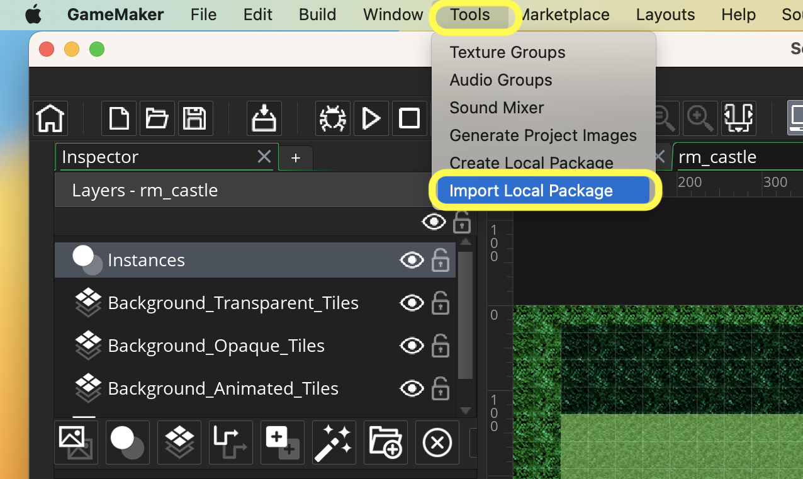

# GMS2-Helper-Packages

<!-- OVERVIEW -->
These are free packages that can be imported into your game and used on your projects.  These all follow the attached LICENSE and are free to use.  I would appreciate if you credit maubygames if you do find them useful.

## Instructions

##### `Step 1.`\|`PLTFRMR`|:small_blue_diamond:
Click the link below for the package you would like. You will then download the <filename>.yymps file.  Open the GameMaker project you want to use it in and select **Tools | Import Local Package**.

* Tested on GameMaker Studio 2022.11.175

 

<!-- TOC -->
## GMS2 Top Down Shooter - Table of Contents

<kbd></kbd> &nbsp;&nbsp; [Setting Up](setting-up/README.md#user-content-setting-up)  
<kbd></kbd> &nbsp;&nbsp; [Background Tiles](background-tiles/README.md#user-content-background-tiles)  
<kbd></kbd> &nbsp;&nbsp; [Setup Player](setup-player/README.md#user-content-setup-player)  
<kbd></kbd> &nbsp;&nbsp; [Gravity and Ground Collision](gravity-collision/README.md#user-content-gravity-and-ground-collision)  
<kbd></kbd> &nbsp;&nbsp; [Gravity and Ground Collision II](gravity-collision-ii/README.md#user-content-gravity-and-ground-collision-ii) 
<kbd></kbd> &nbsp;&nbsp; [Lateral Movement and Wall Collision](lateral-collision/README.md#user-content-lateral-movement-and-wall-collision) 
<kbd></kbd> &nbsp;&nbsp; [Lateral Movement and Wall Collision II](lateral-collision-ii/README.md#user-content-lateral-movement-and-wall-collision-ii) 
<kbd></kbd> &nbsp;&nbsp; [Jumping and Ceiling Collision](jumping-ceiling/README.md#user-content-jumping-and-ceiling-collision) 
<kbd></kbd> &nbsp;&nbsp; [Jumping and Ceiling Collision II](jumping-ceiling-ii/README.md#user-content-jumping-and-ceiling-collision-ii) 
<kbd></kbd> &nbsp;&nbsp; [Moving Platforms](moving-platforms/README.md#user-content-moving-platforms) 
<kbd></kbd> &nbsp;&nbsp; [Moving Platforms II](moving-platforms-ii/README.md#user-content-moving-platforms-ii) 
<kbd></kbd> &nbsp;&nbsp; [Ground Hazards](ground-hazards/README.md#user-content-ground-hazards) 
<kbd></kbd> &nbsp;&nbsp; [Health Bar](health-bar/README.md#user-content-health-bar) 
<kbd></kbd> &nbsp;&nbsp; [Lives](lives/README.md#user-content-lives) 
<kbd></kbd> &nbsp;&nbsp; [Flame Enemy](flame/README.md#user-content-flame-enemy) 
<kbd></kbd> &nbsp;&nbsp; [Jump Through Collisions](clouds/README.md#user-content-jump-through-collisions) 
<kbd></kbd> &nbsp;&nbsp; [Change Rooms](rooms/README.md#user-content-change-rooms) 
<kbd></kbd> &nbsp;&nbsp; [Audio](audio/README.md#user-content-audio) 
<!-- LICENSE -->
## License
Distributed under the MIT License. See `LICENSE` for more information: [link](LICENSE).

## Keyboard Controls
* Left, Right,moves player in 2 directions
* Space bar jumps

## Gamepad Controls
* Left analog stick moves player
* Right trigger shoots
* Start button begins the game

Dev Tips

make git m="add commit message"

