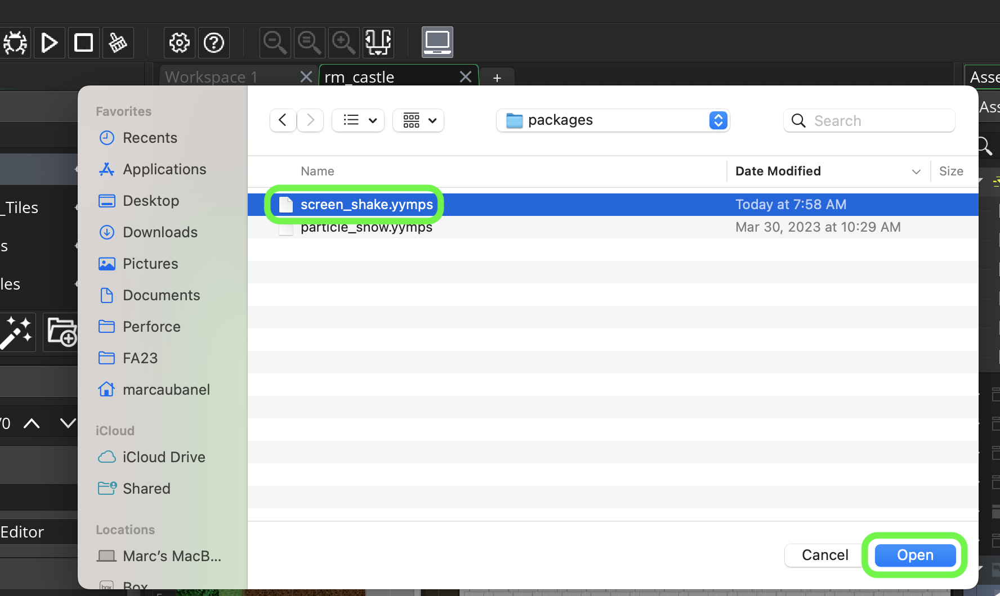
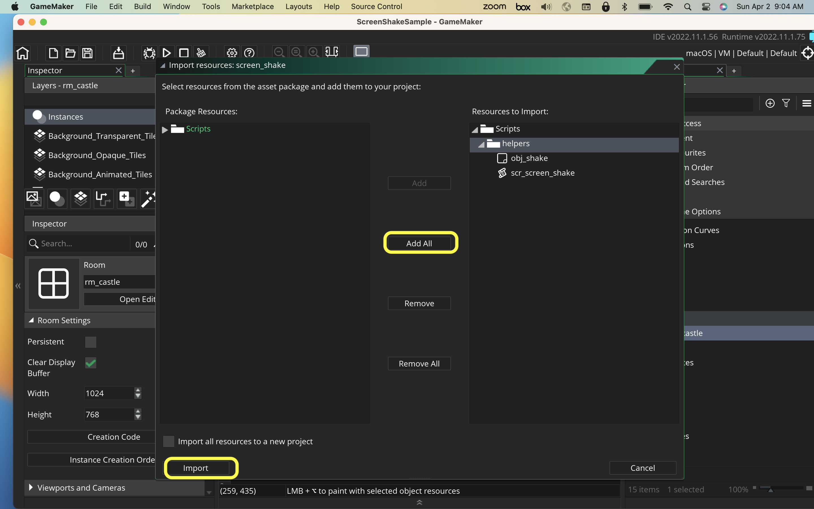

# GMS2-Helper-Packages

<!-- OVERVIEW -->
These are free packages that can be imported into your game and used on your projects.  These all follow the attached LICENSE and are free to use.  I would appreciate if you credit maubygames if you do find them useful.

## Instructions

##### `Step 1.`\|`PLTFRMR`|:small_blue_diamond:
Click the link below for the package you would like. You will then download the <filename>.yymps file.  Open the GameMaker project you want to use it in and select **Tools | Import Local Package**.

##### `Step 2.`\|`PLTFRMR`|:small_blue_diamond: :small_blue_diamond: 

Select the package you downloaded to your computer.

##### `Step 3.`\|`PLTFRMR`|:small_blue_diamond: :small_blue_diamond: :small_blue_diamond:

Press the <kbd>Add All</kbd> button then press the <kbd>Import</kbd> button.  Now you have all the items you need to take advantage of this package. 

* Tested on GameMaker Studio 2022.11.175

 

<!-- TOC -->
## GMS2 Packages - Table of Contents

<kbd></kbd> &nbsp;&nbsp; [Screen Shake](screen-shake/README.md#user-content-screen-shake)  

<!-- LICENSE -->
## License
Distributed under the MIT License. See `LICENSE` for more information: [link](LICENSE).

## Keyboard Controls
* Left, Right,moves player in 2 directions
* Space bar jumps

## Gamepad Controls
* Left analog stick moves player
* Right trigger shoots
* Start button begins the game

Dev Tips

make git m="add commit message"

