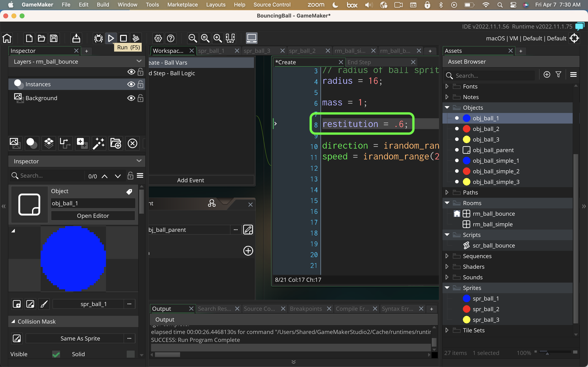

### Bouncing Ball

[home](../README.md#user-content-gms2-packages---table-of-contents)

This package has 4 scripts.  You only need to call two of them and the other two are called by the scripts themself.

* Syntax::
`ball_bounce_simple(_parent_obj, _bounce_off_bounds=true)`

* Arguments:
* `_parent_obj` game needs to pass a single reference for all bouncing balls.  If there is one ball boject you would pass tis object otherwise use a common parent object on all balls.

* Optional Arguments:
* `_bounce_off_bounds` defaults to True. Determines whether balls bounces off edges of level to say in bounds.

* Description:
The script `ball_bounce_simple` requires the object passed to be circular (the collision detection is done within this function and only works properly with circles) and must contain a variable called `radius` which holds the radius of the circle.  The origin needs to be in the middle of the circle.  This simple collision treats all balls as the same mass.

* Syntax::
`ball_bounce(_parent_obj, _bounce_off_bounds=true)`

* Arguments:
* `_parent_obj` game needs to pass a single reference for all bouncing balls.  If there is one ball boject you would pass tis object otherwise use a common parent object on all balls.

* Optional Arguments:
* `_bounce_off_bounds` defaults to True. Determines whether balls bounces off edges of level to say in bounds.

* Description:
The script `ball_bounce` requires the object passed to be circular (the collision detection is done within this function and only works properly with circles) and must contain a variable called `radius` which holds the radius of the circle.  The origin needs to be in the middle of the circle.  Each object needs a variable called `mass` which holds the weight of the object.  The scale is arbitrary and the mass is realtive (so an object with a mass of `4` is twice as heavy as a mass of `2`).  You also need to include a variable called `restitution`.  If it is set to `1` it is a perfectly elastic collision so no energy is lossed by the bound.  Any value greater will accelerate the bounce and smaller will lose enery after each bounce.

 

---

##### `Step 1.`\|`PCKGS`|:small_blue_diamond:

Download the [ball bounce](../packages/scr_ball_bounce.yymps) package of scripts. Import the package per the instructions in the home page of this GitHub repository.

##### `Step 2.`\|`PCKGS`|:small_blue_diamond: :small_blue_diamond: 

Create some different spritee sizes and name them appropriately.  Make sure the origin is centered horizontally and vertically or the scripts will look completely wrong.

##### `Step 3.`\|`PCKGS`|:small_blue_diamond: :small_blue_diamond: :small_blue_diamond:

Create an object called `obj_ball_parent` with nothing in it.  All balls that we want to check for collisions will contain this parent.  This way we can have as many different size balls as we like!

##### `Step 4.`\|`PCKGS`|:small_blue_diamond: :small_blue_diamond: :small_blue_diamond: :small_blue_diamond:

Now add a ball object for each sprite you have created.

##### `Step 5.`\|`PCKGS`| :small_orange_diamond:

Add `obj_ball_parent` to all ball objects you have. This is used to ensure that they are checked for collision detection.

##### `Step 6.`\|`PCKGS`| :small_orange_diamond: :small_blue_diamond:

Add a **Create** event to each object and add the radius of the ball and pick a random diretion and speed.

##### `Step 7.`\|`PCKGS`| :small_orange_diamond: :small_blue_diamond: :small_blue_diamond:

Now add an **End Step** event.  Call `ball_bounce_simple(obj_ball_parent)`. We are using `speed` so the position is only updated **AFTER** the **Step** event.  The second boolean is whether the object bounces off the walls (edges of level) or not. If it is set to `false` the balls will leave the level. So if you don't include the boolean, it is set to `true` by default and will bounce off the sides.

##### `Step 8.`\|`PCKGS`| :small_orange_diamond: :small_blue_diamond: :small_blue_diamond: :small_blue_diamond:

Make a room and populate it with a variety of balls. 

##### `Step 9.`\|`PCKGS`| :small_orange_diamond: :small_blue_diamond: :small_blue_diamond: :small_blue_diamond: :small_blue_diamond:

Now *press* the <kbd>Play</kbd> button in the top menu bar to launch the game. Notice that the balls all have the same weight but do bounce correctly. The yellow balls were marked with `false` so they leave the room and don't bounce off the sides.

https://user-images.githubusercontent.com/5504953/230612785-31c7829a-acee-4686-95ae-ccabfe87c667.mp4

##### `Step 10.`\|`PCKGS`| :large_blue_diamond:

Now lets use the more complex script which takes into account mass (how much mass an object has).  Remember momentum = mass x velocity so a heavier object provides greater velocity transfer when running into a lighter object.  We also have to include `restitution` or the game will crash.  We will leave it at `1` which makes the collisions elastic (no energy is lost on bounces). 

##### `Step 11.`\|`PCKGS`| :large_blue_diamond: :small_blue_diamond: 

Now in the **End Step** event we will call `ball_bounce()` in the same way we did before.

##### `Step 12.`\|`PCKGS`| :large_blue_diamond: :small_blue_diamond: :small_blue_diamond: 

Now create a new room and populate them with the balls that take this more complex algorithm.

##### `Step 13.`\|`PCKGS`| :large_blue_diamond: :small_blue_diamond: :small_blue_diamond:  :small_blue_diamond: 

Now *press* the <kbd>Play</kbd> button in the top menu bar to launch the game. Notice that the ball's weight affects the results of the bouncing and there is more realism.

https://user-images.githubusercontent.com/5504953/230614225-3b06b3ac-e8f8-4062-913d-888e4b6f2f1d.mp4

##### `Step 14.`\|`PCKGS`| :large_blue_diamond: :small_blue_diamond: :small_blue_diamond: :small_blue_diamond:  :small_blue_diamond: 

Now if we want collisions to not be elastic and to lose speed to heat/friction then you can remove velocity from the bounce.  Change the `restitution` variable to lower the `1` (not less than 0) to lose some momentum.  The algorithm on a collision will take the smallest of the two.  So any balls that bounce with blue ones will have the blue ball's resitution.

##### `Step 15.`\|`PCKGS`| :large_blue_diamond: :small_orange_diamond: 

Now *press* the <kbd>Play</kbd> button in the top menu bar to launch the game. Now we have non-elastic collisions (but no friction in the game)

<!--  -->

| [home](../README.md#user-content-gms2-packages---table-of-contents)|
|---|
