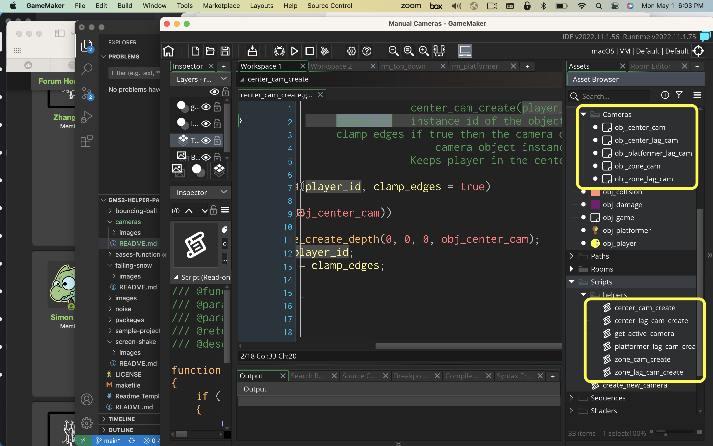
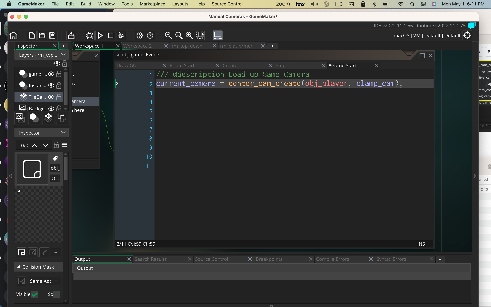

### Custom Cameras

[home](../README.md#user-content-gms2-packages---table-of-contents)

I have included 5 custom cameras that extend the basic functionality found in **GameMaker**.

* `center_cam_create(player_id)`
* `center_lag_cam_create(player_id)`
* `zone_cam_create(player_id)`
* `zone_lag_cam_create(player_id)`
* `platformer_lag_cam_create((player_id))`

For most of these all you need to do is call the function and pass it the instance ID of the character you want the camera to follow and it should work. 

 

---

##### `Step 1.`\|`PCKGS`|:small_blue_diamond:

Download the [custom_cameras.yymps](../packages/custom_cameras.yymps) from this repository. Import the packge into the game you want to use it in and select **Tools | Import Local Package**. Press the <kbd>Add All</kbd> button then press the <kbd>Import</kbd> button.  This package comes with everything you need that includes 6 scripts and 5 objects.  You do not need to include any of these objects in the level calling the script is all you need to do.

##### `Step 2.`\|`PCKGS`|:small_blue_diamond: :small_blue_diamond: 

The first camera is one that keeps the player dead center of the screen.  In any game where enemies come in from all directions this is a good choice. You only need to call it once though and these scripts should **NOT** be called from **Step** events.  I called the first camera in a **Other | Game Start** event that will run for the entire game.

`current_camera = center_cam_create(player_id, [clamp_cam])`

You need to pass it the instance of the player object you want the camera to follow.  In this case I can use `obj_player` as there is only a single instance of this character in the level. This function will create a camera and return the id if you want to further manipulate it.

##### `Step 3.`\|`PCKGS`|:small_blue_diamond: :small_blue_diamond: :small_blue_diamond:

When you press the <kbd>Play</kbd> button you will see that the camera keeps the player dead center the entire time.

https://user-images.githubusercontent.com/5504953/235547733-65725f97-91c8-4695-82ec-70e5c6282ee9.mp4

##### `Step 4.`\|`PCKGS`|:small_blue_diamond: :small_blue_diamond: :small_blue_diamond: :small_blue_diamond:

`current_camera = center_cam_create(player_id, [clamp_cam])`

There is one optional parameter boolean `clamp_cam`.  It defaults to `true`.  This stops the camera from showing outside the playable area.  If set to `false` then it will follow the character right to the edge of the level.

https://user-images.githubusercontent.com/5504953/235547924-69589f72-ab46-4c8c-903f-45230b4a1a39.mp4

##### `Step 5.`\|`PCKGS`| :small_orange_diamond:

https://user-images.githubusercontent.com/5504953/235548144-5e57d602-2c34-467a-ad75-86f947ec4fbc.mp4

##### `Step 6.`\|`PCKGS`| :small_orange_diamond: :small_blue_diamond:

https://user-images.githubusercontent.com/5504953/235548161-86a1af20-6f05-441b-b42f-a506a83fa8c1.mp4

##### `Step 7.`\|`PCKGS`| :small_orange_diamond: :small_blue_diamond: :small_blue_diamond:

https://user-images.githubusercontent.com/5504953/235548177-949c5e85-a85c-4c9f-9e70-b2605a157615.mp4

##### `Step 8.`\|`PCKGS`| :small_orange_diamond: :small_blue_diamond: :small_blue_diamond: :small_blue_diamond:

##### `Step 9.`\|`PCKGS`| :small_orange_diamond: :small_blue_diamond: :small_blue_diamond: :small_blue_diamond: :small_blue_diamond:

##### `Step 10.`\|`PCKGS`| :large_blue_diamond:

##### `Step 11.`\|`PCKGS`| :large_blue_diamond: :small_blue_diamond: 
https://user-images.githubusercontent.com/5504953/235547614-3bbc1f7b-fcbf-4edc-b668-2474ea8d7924.mp4

##### `Step 12.`\|`PCKGS`| :large_blue_diamond: :small_blue_diamond: :small_blue_diamond: 

##### `Step 13.`\|`PCKGS`| :large_blue_diamond: :small_blue_diamond: :small_blue_diamond:  :small_blue_diamond: 

##### `Step 14.`\|`PCKGS`| :large_blue_diamond: :small_blue_diamond: :small_blue_diamond: :small_blue_diamond:  :small_blue_diamond: 

##### `Step 15.`\|`PCKGS`| :large_blue_diamond: :small_orange_diamond: 

##### `Step 16.`\|`PCKGS`| :large_blue_diamond: :small_orange_diamond:   :small_blue_diamond: 

##### `Step 17.`\|`PCKGS`| :large_blue_diamond: :small_orange_diamond: :small_blue_diamond: :small_blue_diamond:

##### `Step 18.`\|`PCKGS`| :large_blue_diamond: :small_orange_diamond: :small_blue_diamond: :small_blue_diamond: :small_blue_diamond:

##### `Step 19.`\|`PCKGS`| :large_blue_diamond: :small_orange_diamond: :small_blue_diamond: :small_blue_diamond: :small_blue_diamond: :small_blue_diamond:

##### `Step 20.`\|`PCKGS`| :large_blue_diamond: :large_blue_diamond:

##### `Step 21.`\|`PCKGS`| :large_blue_diamond: :large_blue_diamond: :small_blue_diamond:

<!--  -->

| [home](../README.md#user-content-gms2-packages---table-of-contents)|
|---|
