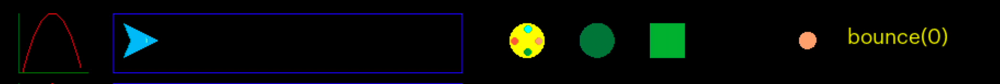
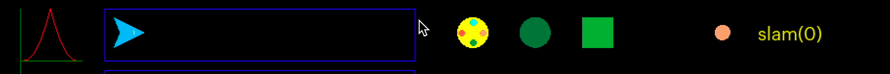
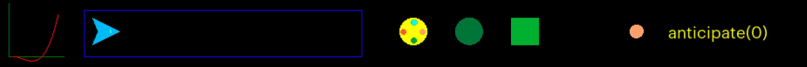
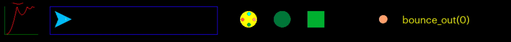
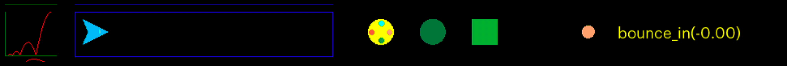
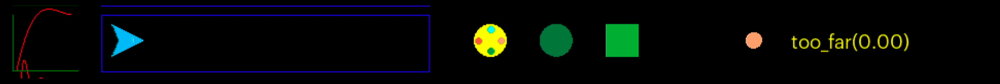
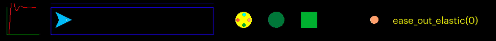

### Eases & Functions

<sub>[home](../README.md#user-content-gms2-packages---table-of-contents)</sub>


**TLDR**<br/>
Download [Eases Package](../packages/eases.yymps) to extend the usefullness of the [`lerp(a, b, amt)`](https://manual.yoyogames.com/GameMaker_Language/GML_Reference/Maths_And_Numbers/Number_Functions/lerp.htm) function that is part of gamemaker. It includes these non linear functions:

* `ease_in_2(time)`
* `ease_in_3(time)`
* `ease_in_4(time)`
* `ease_out_2(time)`
* `ease_out_3(time)`
* `ease_out_4(time)`
* `ease_in_out_2(time)`
* `ease_in__out3(time)`
* `ease_in_out_4(time)`
* `bounce(time)`
* `slam(time)`
* `anticipate(time)`
* `bounce_out(time)`
* `bounce_in(time)`
* `too_far(time)`
* `ease_out_elastic(time)`

A sample project can be played to see all the functions in action by downloading and running [Eases](../sample-projects/Eases.zip)
<br>

---

##### `Step 1.`\|`PCKGS`|:small_blue_diamond:

Download the [Eases](../packages/eases.yymps) packages and unzip the folder.  In the project you want to use it selet **Tools | Import Local Package** and select the **eases.yymps** file. Then import the `scr_eases` into your project which will contain all the functions you will need.


##### `Step 2.`\|`PCKGS`|:small_blue_diamond: :small_blue_diamond: 

Lets first look at the existing function in gamemaker that performs a linear interpolation (*lerp* for short).  

[`lerp(a, b, amt)`](https://manual.yoyogames.com/GameMaker_Language/GML_Reference/Maths_And_Numbers/Number_Functions/lerp.htm)

This changes a value **a** to value **b** by an **amount**.  If the amount is `0` then the value is **a**, if the amount is `1` is is the value **b**.  If it is in between it is a blend of the 2.  So in the example below the blue triangle's **x** position is `128` at the start (the **a** value) and `1068` at the end (the **b** value).  We take the time in milliseconds and pass it as the amount.  One way of achieving this is to take (`delta_time / 1000000 / number_of_seconds`).  If you want it to loop you could then take the `% 1` of this value to keep it between the 0 to 1 range. 

Moving our arrow from position a to b:
`x = lerp(128, 769, lerp_time);`

In the below example we also have a rotation `image_angle` that goes from `0` to `359`, two fades that go from `image_alpha` `1` to `0` and `0` to `1`, a color whose red channel goes from `0` to `255` and a scale that goes up 4 times.  This is moves all the different variables in a linear manner where the object moves an a consistent speed. 


##### `Step 3.`\|`PCKGS`|:small_blue_diamond: :small_blue_diamond: :small_blue_diamond:

When we start a car and move from a stop the car has to accelerate or *ease into* getting to its full speed.  So if we graph it it accelerates gradually to full speed.  To do this we can alter the lerp_time variable by passing it to the `ease_in_2` function.  This algorithm multiplies the `lerp_time` by itself.  So when it is `0` it will multiply `0` by `0`.  This means is still starts with value *a*.  Half way through instead of being half way between **a** and **b** it will be .5 * .5 which will be `.25`.  So in a lerp we would be half way through ub in a `ease_in_2` will be only a quarter of the way between the numbers.

```
image_alpha = lerp(1, 0, ease_in_2(lerp_time));
image_alpha = lerp(1, 0, ease_in_3(lerp_time));
image_alpha = lerp(1, 0, ease_in_4(lerp_time));
```


##### `Step 4.`\|`PCKGS`|:small_blue_diamond: :small_blue_diamond: :small_blue_diamond: :small_blue_diamond:

The reverse is true when we a car to come to a stop, it does not do it abruptly.  So if we graph it it the car decelerates gradually to a complete stop.  To do this we can alter the lerp_time variable by passing it to the `ease_out_2` function.  This algorithm multiplies the `lerp_time` by itself.

```
image_alpha = lerp(1, 0, ease_out_2(lerp_time));
image_alpha = lerp(1, 0, ease_out_3(lerp_time));
image_alpha = lerp(1, 0, ease_out_4(lerp_time));
```


##### `Step 5.`\|`PCKGS`| :small_orange_diamond:

Now if we combine the two we can get an ease in and ease out of the value between **a** and **b**. This allows for a smooth start and smooth stop.

```
image_alpha = lerp(1, 0, ease_out_2(lerp_time));
image_alpha = lerp(1, 0, ease_out_3(lerp_time));
image_alpha = lerp(1, 0, ease_out_4(lerp_time));
```


##### `Step 6.`\|`PCKGS`| :small_orange_diamond: :small_blue_diamond:

We can also have functions that create different curves to not only ease but have other animation effects.  This is a a possible bounce effect. So it looks like an object gets an immediate force then goes from 0 to 1 then back to 0 in a natural way like a ball bouncing.

```
image_alpha = lerp(1, 0, bounce(lerp_time));
```




##### `Step 7.`\|`PCKGS`| :small_orange_diamond: :small_blue_diamond: :small_blue_diamond:
This looks like a hammer hitting a spike then bouncing back up.  So a sudden impact reversed the animation.

```
image_alpha = lerp(1, 0, slam(lerp_time));
```




##### `Step 8.`\|`PCKGS`| :small_orange_diamond: :small_blue_diamond: :small_blue_diamond: :small_blue_diamond:

This adds some anticipation into the animation.  Sort of lifting the hammer up before hitting the nail.  This goes below 0 though as it goes back from the starting point before it heads to 1.

```
image_alpha = lerp(1, 0, anticipate(lerp_time));
```




##### `Step 9.`\|`PCKGS`| :small_orange_diamond: :small_blue_diamond: :small_blue_diamond: :small_blue_diamond: :small_blue_diamond:

When the object gets to 1 it bounces 3 times before coming to a stop at 1.

```
image_alpha = lerp(1, 0, bounce_out(lerp_time));
```




##### `Step 10.`\|`PCKGS`| :large_blue_diamond:

A ball jumps three times before making it to 1 (inverse of bounce_out)

```
image_alpha = lerp(1, 0, bounce_in(lerp_time));
```




##### `Step 11.`\|`PCKGS`| :large_blue_diamond: :small_blue_diamond: 

The animation goes past 1 before it comes back to get a sense of follow through/overlapping action.  

```
image_alpha = lerp(1, 0, too_far(lerp_time));
```




##### `Step 12.`\|`PCKGS`| :large_blue_diamond: :small_blue_diamond: :small_blue_diamond: 

Some stuttering overlapping action at the end.

```
image_alpha = lerp(1, 0, ease_out_elastic(lerp_time));
```




<!--  -->


| [home](../README.md#user-content-gms2-packages---table-of-contents)|
|---|
