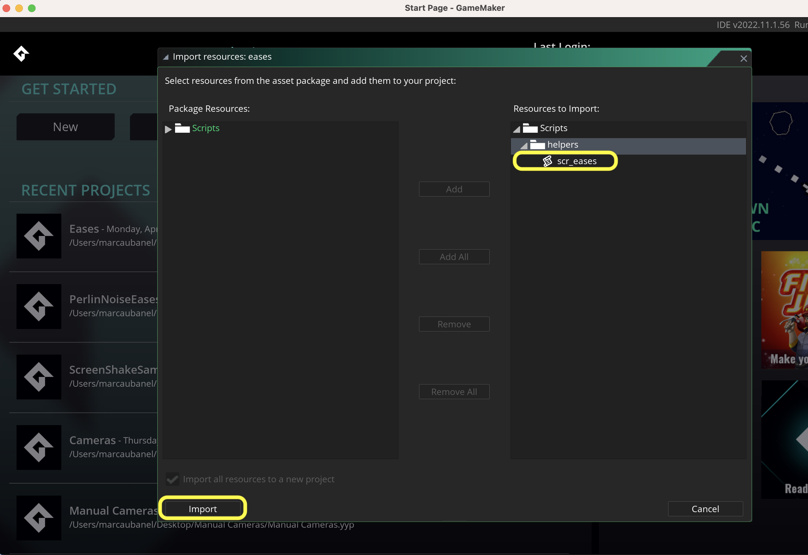
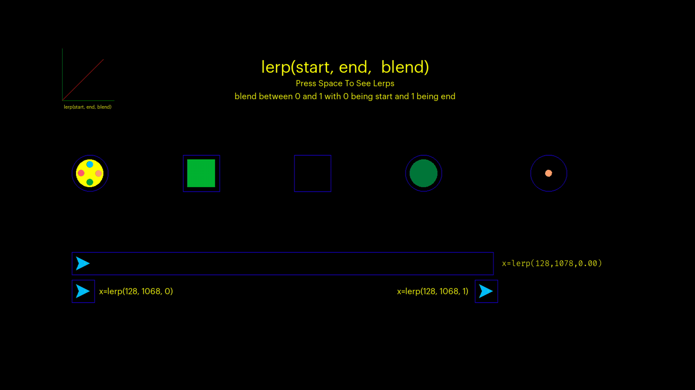

### Eases & Functions

[home](../README.md#user-content-gms2-packages---table-of-contents)

**TLDR** 
Download [Eases Package](../packages/eases.yymps) to extend the usefullness of the [`lerp(a, b, amt)`](https://manual.yoyogames.com/GameMaker_Language/GML_Reference/Maths_And_Numbers/Number_Functions/lerp.htm) function that is part of gamemaker. It includes these non linear functions:

* `ease_in_2(time)`
* `ease_in_3(time)`
* `ease_in_4(time)`
* `ease_out_2(time)`
* `ease_out_3(time)`
* `ease_out_4(time)`
* `ease_in_out_2(time)`
* `ease_in__out3(time)`
* `ease_in_out_4(time)`
* `bounce(time)`
* `slam(time)`
* `anticipate(time)`
* `bounce_out(time)`
* `bounce_in(time)`
* `too_far(time)`
* `ease_out_elastic(time)`

A sample project can be played to see all the functions in action by downloading and running [Eases](../sample-projects/Eases.zip)
 

---

##### `Step 1.`\|`PCKGS`|:small_blue_diamond:

Download the [Eases](../packages/eases.yymps) packages and unzip the folder.  In the project you want to use it selet **Tools | Import Local Package** and select the **eases.yymps** file. Then import the `scr_eases` into your project which will contain all the functions you will need.

##### `Step 2.`\|`PCKGS`|:small_blue_diamond: :small_blue_diamond: 

Lets first look at the existing function in gamemaker that performs a linear interpolation (*lerp* for short).  This changes a value **a** to value **b** by an **amount**.  If the amount is `0` then the value is **a**, if the amount is `1` is is the value **b**.  If it is in between it is a blend of the 2.  So in the example below the blue triangle's **x** position is `128` at the start (the **a** value) and `1068` at the end (the **b** value).  We take the time in milliseconds and pass it as the amount.  One way of achieving this is to take (`delta_time / 1000000 / number_of_seconds`).  If you want it to loop you could then take the `% 1` of this value to keep it between the 0 to 1 range. 

`x = lerp(128, 769, lerp_time);`

In the below example we also have a rotation `image_angle` that goes from `0` to `359`, two fades that go from `image_alpha` `1` to `0` and `0` to `1`, a color whose red channel goes from `0` to `255` and a scale that goes up 4 times.  This is done  

##### `Step 3.`\|`PCKGS`|:small_blue_diamond: :small_blue_diamond: :small_blue_diamond:

##### `Step 4.`\|`PCKGS`|:small_blue_diamond: :small_blue_diamond: :small_blue_diamond: :small_blue_diamond:

##### `Step 5.`\|`PCKGS`| :small_orange_diamond:

##### `Step 6.`\|`PCKGS`| :small_orange_diamond: :small_blue_diamond:

##### `Step 7.`\|`PCKGS`| :small_orange_diamond: :small_blue_diamond: :small_blue_diamond:

##### `Step 8.`\|`PCKGS`| :small_orange_diamond: :small_blue_diamond: :small_blue_diamond: :small_blue_diamond:

##### `Step 9.`\|`PCKGS`| :small_orange_diamond: :small_blue_diamond: :small_blue_diamond: :small_blue_diamond: :small_blue_diamond:

##### `Step 10.`\|`PCKGS`| :large_blue_diamond:

##### `Step 11.`\|`PCKGS`| :large_blue_diamond: :small_blue_diamond: 

##### `Step 12.`\|`PCKGS`| :large_blue_diamond: :small_blue_diamond: :small_blue_diamond: 

##### `Step 13.`\|`PCKGS`| :large_blue_diamond: :small_blue_diamond: :small_blue_diamond:  :small_blue_diamond: 

##### `Step 14.`\|`PCKGS`| :large_blue_diamond: :small_blue_diamond: :small_blue_diamond: :small_blue_diamond:  :small_blue_diamond: 

##### `Step 15.`\|`PCKGS`| :large_blue_diamond: :small_orange_diamond: 

##### `Step 16.`\|`PCKGS`| :large_blue_diamond: :small_orange_diamond:   :small_blue_diamond: 

##### `Step 17.`\|`PCKGS`| :large_blue_diamond: :small_orange_diamond: :small_blue_diamond: :small_blue_diamond:

##### `Step 18.`\|`PCKGS`| :large_blue_diamond: :small_orange_diamond: :small_blue_diamond: :small_blue_diamond: :small_blue_diamond:

##### `Step 19.`\|`PCKGS`| :large_blue_diamond: :small_orange_diamond: :small_blue_diamond: :small_blue_diamond: :small_blue_diamond: :small_blue_diamond:

##### `Step 20.`\|`PCKGS`| :large_blue_diamond: :large_blue_diamond:

##### `Step 21.`\|`PCKGS`| :large_blue_diamond: :large_blue_diamond: :small_blue_diamond:

<!--  -->

| [home](../README.md#user-content-gms2-packages---table-of-contents)|
|---|
