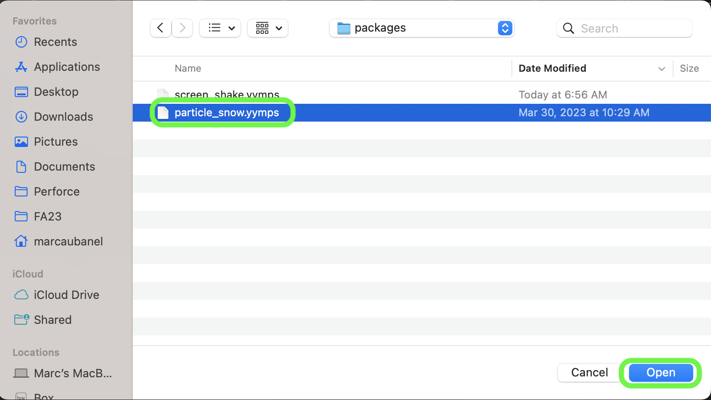
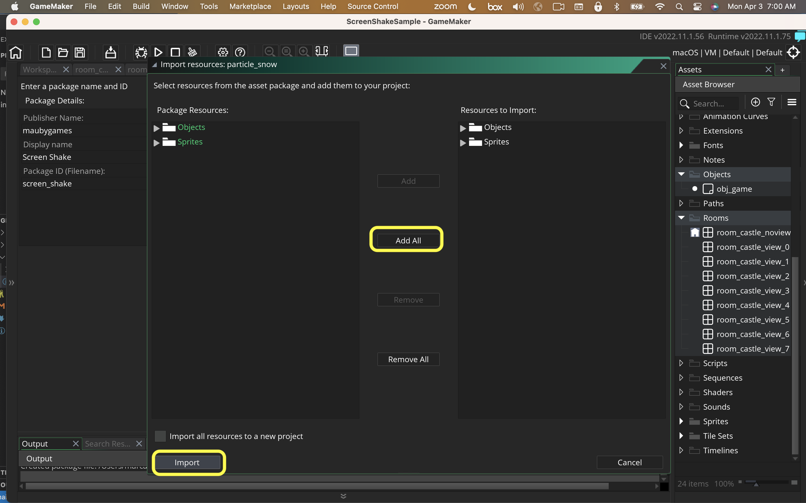

### Falling SNow

[home](../README.md#user-content-gms2-packages---table-of-contents)

This uses the particle system in GameMaker to have a gentle snow fall from the top to the bottom third of the screen.  Go into the particle system and customize the settings. 

`obj_particle_snow` needs to be dropped into a level, and voila, snow!

 

---

##### `Step 1.`\|`PCKGS`|:small_blue_diamond:

Download the [particle snow](../packages/particle_snow.yymps) package.

##### `Step 2.`\|`PCKGS`|:small_blue_diamond: :small_blue_diamond: 

Import into the game you want to use it in and select **Tools | Import Local Package**. Press the <kbd>Add All</kbd> button then press the <kbd>Import</kbd> button. 

##### `Step 3.`\|`PCKGS`|:small_blue_diamond: :small_blue_diamond: :small_blue_diamond:

Drage particle snow into the room.

##### `Step 4.`\|`PCKGS`|:small_blue_diamond: :small_blue_diamond: :small_blue_diamond: :small_blue_diamond:

Now *press* the <kbd>Play</kbd> button in the top menu bar and enjoy the new snow!

https://user-images.githubusercontent.com/5504953/229506142-0eee901e-3bdc-4dcd-97b7-cc8cd55964fe.mp4

<!--  -->

| [home](../README.md#user-content-gms2-packages---table-of-contents)|
|---|
