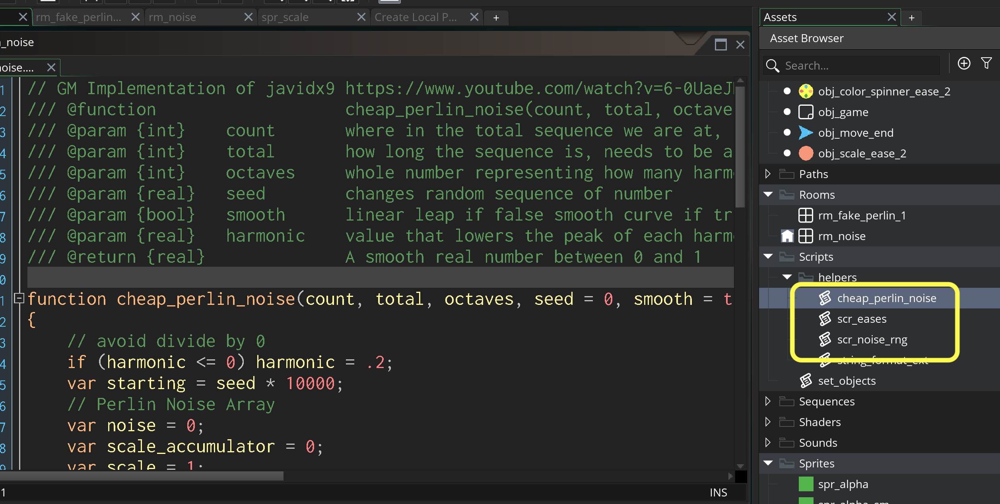

### Noise

[home](../README.md#user-content-gms2-packages---table-of-contents)

Noise and random numbers are very valuable in video games. We will cover using noise as a random number ganerator.  This is based on this excellent [GDC talk](https://www.youtube.com/watch?v=LWFzPP8ZbdU). This allows us a bit more control over how we use and reuse random numbers. We also have a fast implementation of a take on value/perlin noise. 

 

---

##### `Step 1.`\|`PCKGS`|:small_blue_diamond:

Download the [noise](../packages/noise.yymps) package. Notice that you get three functions. 

##### `Step 2.`\|`PCKGS`|:small_blue_diamond: :small_blue_diamond: 

##### `Step 3.`\|`PCKGS`|:small_blue_diamond: :small_blue_diamond: :small_blue_diamond:

##### `Step 4.`\|`PCKGS`|:small_blue_diamond: :small_blue_diamond: :small_blue_diamond: :small_blue_diamond:

##### `Step 5.`\|`PCKGS`| :small_orange_diamond:

##### `Step 6.`\|`PCKGS`| :small_orange_diamond: :small_blue_diamond:

##### `Step 7.`\|`PCKGS`| :small_orange_diamond: :small_blue_diamond: :small_blue_diamond:

##### `Step 8.`\|`PCKGS`| :small_orange_diamond: :small_blue_diamond: :small_blue_diamond: :small_blue_diamond:

##### `Step 9.`\|`PCKGS`| :small_orange_diamond: :small_blue_diamond: :small_blue_diamond: :small_blue_diamond: :small_blue_diamond:

##### `Step 10.`\|`PCKGS`| :large_blue_diamond:

##### `Step 11.`\|`PCKGS`| :large_blue_diamond: :small_blue_diamond: 

##### `Step 12.`\|`PCKGS`| :large_blue_diamond: :small_blue_diamond: :small_blue_diamond: 

##### `Step 13.`\|`PCKGS`| :large_blue_diamond: :small_blue_diamond: :small_blue_diamond:  :small_blue_diamond: 

##### `Step 14.`\|`PCKGS`| :large_blue_diamond: :small_blue_diamond: :small_blue_diamond: :small_blue_diamond:  :small_blue_diamond: 

##### `Step 15.`\|`PCKGS`| :large_blue_diamond: :small_orange_diamond: 

##### `Step 16.`\|`PCKGS`| :large_blue_diamond: :small_orange_diamond:   :small_blue_diamond: 

##### `Step 17.`\|`PCKGS`| :large_blue_diamond: :small_orange_diamond: :small_blue_diamond: :small_blue_diamond:

##### `Step 18.`\|`PCKGS`| :large_blue_diamond: :small_orange_diamond: :small_blue_diamond: :small_blue_diamond: :small_blue_diamond:

##### `Step 19.`\|`PCKGS`| :large_blue_diamond: :small_orange_diamond: :small_blue_diamond: :small_blue_diamond: :small_blue_diamond: :small_blue_diamond:

##### `Step 20.`\|`PCKGS`| :large_blue_diamond: :large_blue_diamond:

##### `Step 21.`\|`PCKGS`| :large_blue_diamond: :large_blue_diamond: :small_blue_diamond:

<!--  -->

| [home](../README.md#user-content-gms2-packages---table-of-contents)|
|---|
