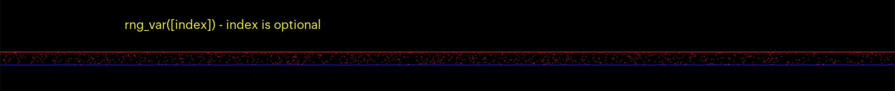
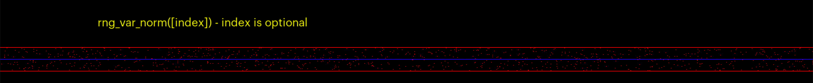
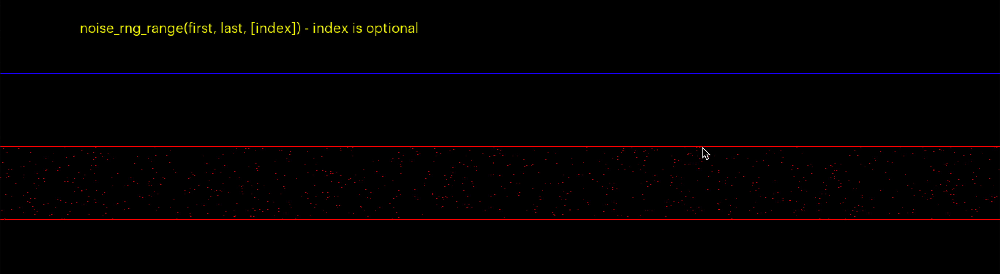
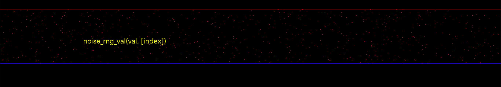
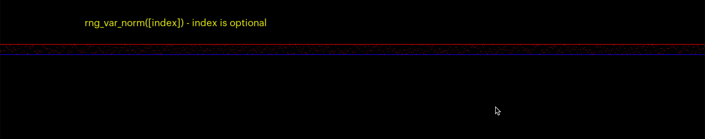

### Noise

[home](../README.md#user-content-gms2-packages---table-of-contents)

Noise and random numbers are very valuable in video games. We will cover using noise as a random number ganerator.  This is based on this excellent [GDC talk](https://www.youtube.com/watch?v=LWFzPP8ZbdU). This allows us a bit more control over how we use and reuse random numbers. We also have a fast implementation of a take on value/perlin noise. 

 

---

##### `Step 1.`\|`PCKGS`|:small_blue_diamond:

Download the [noise](../packages/noise.yymps) package. Notice that you get three functions. It comes with a range of random noise functions in `scr_noise_rng`.  There is a a `cheap_perlin_noise()` function to create structured noise.  It used `scr_ease` to smooth out the transitions between points used by the cheap_perlin_noise function.

##### `Step 2.`\|`PCKGS`|:small_blue_diamond: :small_blue_diamond: 

We can call `rng_var()` and if we pass no parameters then we will just get a random number that changes over time.  This function returns a real number between `0` and `1`. This example is picking a random y position using this noise function.  Notice that it is constantly changing and quite random. 

##### `Step 3.`\|`PCKGS`|:small_blue_diamond: :small_blue_diamond: :small_blue_diamond:

`rng_var_norm()` is very similar except it returns a range from `-1` to `1`.

##### `Step 4.`\|`PCKGS`|:small_blue_diamond: :small_blue_diamond: :small_blue_diamond: :small_blue_diamond:

`rng_var_range(start, end)` is very similar except it returns a range from the parameters passed `start` to `end`. For this to work the start value needs to be smaller than the end value. The below example is randomly selecting from `rng_var(-20, -10)` which is picking a fractional number between -20 and -10.

##### `Step 5.`\|`PCKGS`| :small_orange_diamond:

`rng_var_val(value)` is very similar except it returns a real number range between `0` to `val` if val is positive and `val` to `0` if val is negative. The below example is randomly selecting from `rng_var(-15)` which is picking a fractional number between 0 and 15.

##### `Step 6.`\|`PCKGS`| :small_orange_diamond: :small_blue_diamond:

This can become powerful as we can recall the same random number sequence at will to create more complex structures.  In the case below I am passing `rng_rand()`, `rng_rand_norm()`, `rng_rand_range()` and `rng_rand_val` the same seed.  So every frame it is picking the exact same `y` value and even though it is random, we are refering to the same index over and over again so the noise no longer moves like it did above.

##### `Step 7.`\|`PCKGS`| :small_orange_diamond: :small_blue_diamond: :small_blue_diamond:

##### `Step 8.`\|`PCKGS`| :small_orange_diamond: :small_blue_diamond: :small_blue_diamond: :small_blue_diamond:

##### `Step 9.`\|`PCKGS`| :small_orange_diamond: :small_blue_diamond: :small_blue_diamond: :small_blue_diamond: :small_blue_diamond:

##### `Step 10.`\|`PCKGS`| :large_blue_diamond:

##### `Step 11.`\|`PCKGS`| :large_blue_diamond: :small_blue_diamond: 

##### `Step 12.`\|`PCKGS`| :large_blue_diamond: :small_blue_diamond: :small_blue_diamond: 

##### `Step 13.`\|`PCKGS`| :large_blue_diamond: :small_blue_diamond: :small_blue_diamond:  :small_blue_diamond: 

##### `Step 14.`\|`PCKGS`| :large_blue_diamond: :small_blue_diamond: :small_blue_diamond: :small_blue_diamond:  :small_blue_diamond: 

##### `Step 15.`\|`PCKGS`| :large_blue_diamond: :small_orange_diamond: 

##### `Step 16.`\|`PCKGS`| :large_blue_diamond: :small_orange_diamond:   :small_blue_diamond: 

##### `Step 17.`\|`PCKGS`| :large_blue_diamond: :small_orange_diamond: :small_blue_diamond: :small_blue_diamond:

##### `Step 18.`\|`PCKGS`| :large_blue_diamond: :small_orange_diamond: :small_blue_diamond: :small_blue_diamond: :small_blue_diamond:

##### `Step 19.`\|`PCKGS`| :large_blue_diamond: :small_orange_diamond: :small_blue_diamond: :small_blue_diamond: :small_blue_diamond: :small_blue_diamond:

##### `Step 20.`\|`PCKGS`| :large_blue_diamond: :large_blue_diamond:

##### `Step 21.`\|`PCKGS`| :large_blue_diamond: :large_blue_diamond: :small_blue_diamond:

<!--  -->

| [home](../README.md#user-content-gms2-packages---table-of-contents)|
|---|
