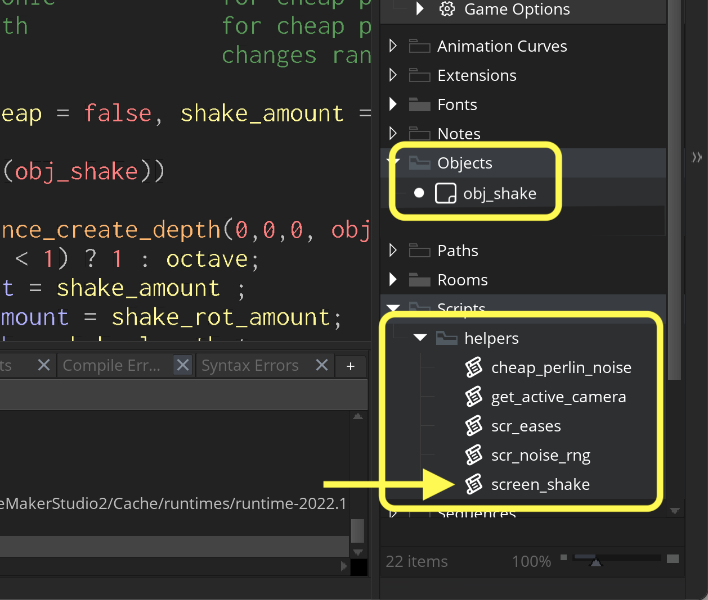
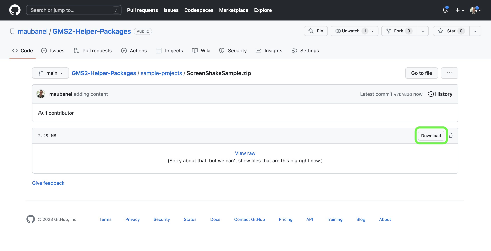

### Screen Shake

[home](../README.md#user-content-gms2-packages---table-of-contents)

This package has one script `screen_shake` and one object `obj_shake`. 

* Syntax:
`screen_shake()`

* Optional arguments:
* `_number_of_shakes`.  Default value is `10`.  This is how many time the camera changes postions for the shake.  It will make it looks like it shakes faster if the number is higher or lower is the number is lower.
* `_shake_range`. Default value is `10`. A radius of pixels for how far the camera will move.  This increased the amoutn of displacement of the shake.
* `_shake_length`.  Defautls to `0.5`.  This is the number of seconds the camera shakes before it stops.  
* `_angle_range`.  Defaults to `0.3`°.  This is how many degrees the camera tilts.  Be careful about making this larger than 2 as it will be very disorienting and cause dizinness.

 

---

##### `Step 1.`\|`PCKGS`|:small_blue_diamond:

Download the [screen shake](../packages/screen_shake.yymps) package.

##### `Step 2.`\|`PCKGS`|:small_blue_diamond: :small_blue_diamond: 

This packages comes with multiple files.  You should have an **obj_shake** object and the following scripts:

* **cheap_perlin_noise**
* **get_active_camera**
* **scr_easaes**
* **scr_noise_rng**
* **screen_shake**

There are mostly helper functions and you can do everything through the `screen_shake()` function.

##### `Step 3.`\|`PCKGS`|:small_blue_diamond: :small_blue_diamond: :small_blue_diamond:

The simplest execution is to just call `screen_shake()` without passing any parameters. The shake will use the more expensive algorithm (looks better), will have a shake radius of 30 pixels, a shake rotation of 1°, a shake that will last for one second, with 5 octaves, harmonics of `0.3`, smooth transition between random points and a random seed of `0` . You can trigger it based on any event, I wired it up to a button press just to test the functionality by pressing the space bar. 

##### `Step 4.`\|`PCKGS`|:small_blue_diamond: :small_blue_diamond: :small_blue_diamond: :small_blue_diamond:

Now *press* the <kbd>Play</kbd> button in the top menu bar to launch the game. Notice the screen shakes for a second.

##### `Step 5.`\|`PCKGS`| :small_orange_diamond:

##### `Step 6.`\|`PCKGS`| :small_orange_diamond: :small_blue_diamond:

You can also download this sample project if you want to see it in action: [Screen Shake Sample](../sample-projects/ScreenShakeSample.zip).

<!--  -->

| [home](../README.md#user-content-gms2-packages---table-of-contents)|
|---|
