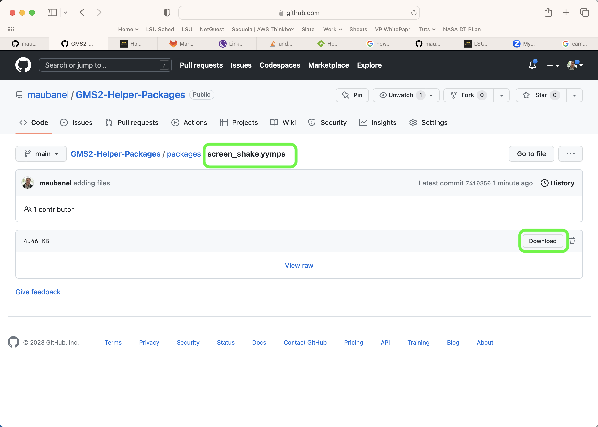
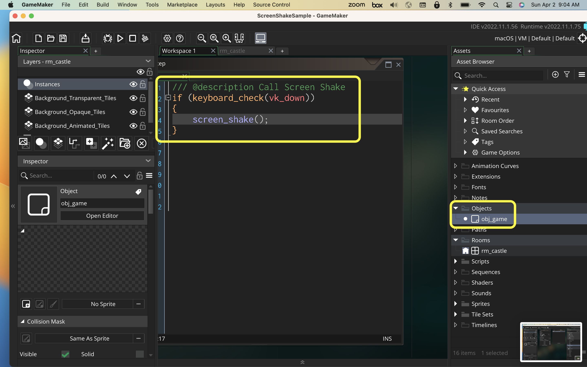
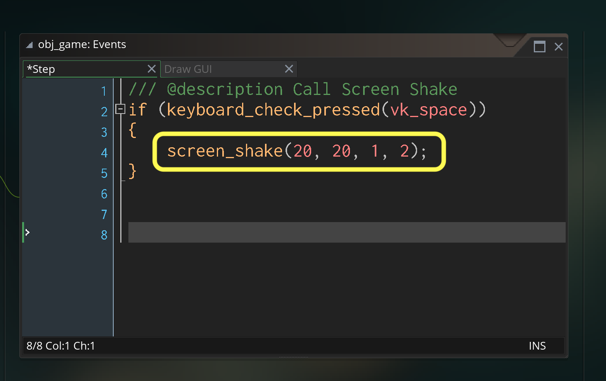

### Screen Shake

[home](../README.md#user-content-gms2-packages---table-of-contents)

This package has one script `screen_shake` and one object `obj_shake`. 

* Syntax:
`screen_shake();

* Optional arguments:
* `_number_of_shakes`.  Default value is `10`.  This is how many time the camera changes postions for the shake.  It will make it looks like it shakes faster if the number is higher or lower is the number is lower.
* `_shake_range`. Default value is `10`. A radius of pixels for how far the camera will move.  This increased the amoutn of displacement of the shake.
* `_shake_length`.  Defautls to `0.5`.  This is the number of seconds the camera shakes before it stops.  
* `_angle_range`.  Defaults to `0.3`°.  This is how many degrees the camera tilts.  Be careful about making this larger than 2 as it will be very disorienting and cause dizinness.

 

---

##### `Step 1.`\|`PCKGS`|:small_blue_diamond:

Download the [screen shake](../packages/screen_shake.yymps) package.

##### `Step 2.`\|`PCKGS`|:small_blue_diamond: :small_blue_diamond: 

The simplest execution is to just call `screen_shake()` without passing any parameters (the default parameters are indicated above). THe shake will last for half a second, have a radius of 10 pixels, will shake 10 times and will have an angle tilt of 0.3°. You can trigger it based on any event, I wired it up to a button press just to test the functionality by pressing the space bar.

##### `Step 3.`\|`PCKGS`|:small_blue_diamond: :small_blue_diamond: :small_blue_diamond:

Now *press* the <kbd>Play</kbd> button in the top menu bar to launch the game. Notice the screen shakes for half a second.

https://user-images.githubusercontent.com/5504953/229501048-747658a9-3d17-4aeb-bf04-2672f32ae269.mp4

##### `Step 4.`\|`PCKGS`|:small_blue_diamond: :small_blue_diamond: :small_blue_diamond: :small_blue_diamond:

You can override the defaults by passing parameters to the function. In this case we have shake that will happen 20 times, with a radius of 20 pixels a length of 1 second and an angle different of up to 2°.

##### `Step 5.`\|`PCKGS`| :small_orange_diamond:

Now *press* the <kbd>Play</kbd> button in the top menu bar to launch the game. You can play with different parameters to get different effects.

https://user-images.githubusercontent.com/5504953/229501118-5c76a026-ca53-40da-a83c-ebaeb6e764d4.mp4

<!--  -->

| [home](../README.md#user-content-gms2-packages---table-of-contents)|
|---|
